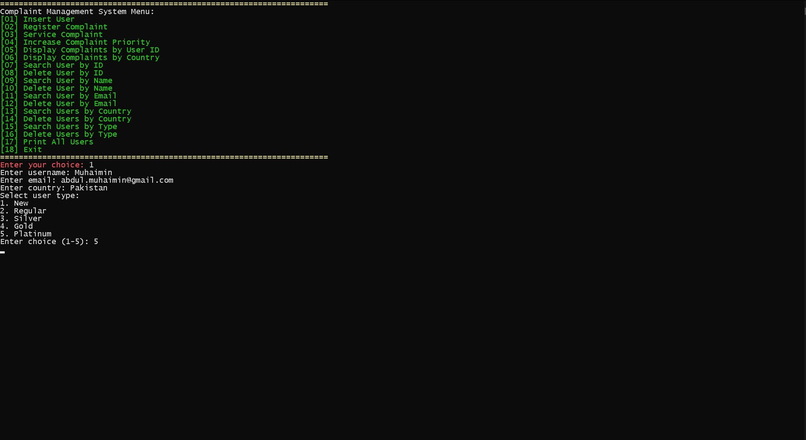
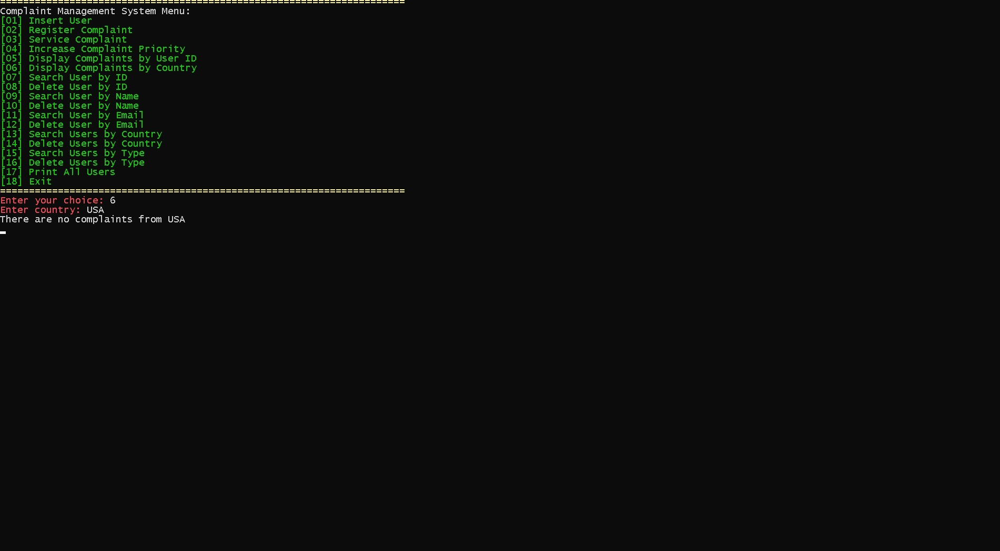

# Data Structures

This collection includes the assignments, lab work and some practice problems I've solved and various data structures I've implemented from scratch as part of my Data Structures course.

# Complaint Management System

## Overview
The Complaint Management System is an efficient, feature-rich project designed for the seamless management of user complaints. Leveraging advanced data structures like linked lists, heaps, hashmaps, and AVL trees, this system ensures fast complaint registration, processing, and retrieval. Robust exception handling is implemented to provide a smooth user experience and prevent system crashes.

## Features
1. **Insert User**: Add new users to the system with dynamic storage and efficient retrieval mechanisms.
2. **Register Complaint**: File a new complaint, prioritized automatically.
3. **Service Complaint**: Resolve the highest-priority complaint efficiently.
4. **Increase Complaint Priority**: Update the priority of existing complaints.
5. **Search and Display Complaints**:
   - By User ID
   - By Country
6. **Search and Manage Users**:
   - By ID, Name, Email, Country, and Type
   - Delete users individually or in bulk
7. **Display All Users**: Print a list of all users in the system.
8. **Exit**: Safely close the program with proper resource management.

## Data Structures Used
- **Linked Lists**: Singly and Doubly Linked Lists for dynamic user and complaint data storage.
- **Qeues**: For level order traversal of AVL Trees.
- **Heaps**: For managing and servicing complaints by priority.
- **Hashmaps**: For O(1) average-time complexity lookups.
- **AVL Trees**: For efficient searching and filtering by attributes.
- **Enums**: For defining various types of Customers. (New, Regular, Silver, Gold, Platinum)

## Exception Handling
- All operations are wrapped in robust exception handling blocks.
- The system gracefully handles invalid inputs, data retrieval errors, and edge cases to ensure a seamless experience.

## Contributions
Contributions are welcome! Please fork the repository and submit a pull request.

---

Feel free to customize this further if needed!

# Screenshots of CMS

Here are the screenshots of Complaint Management System: 

